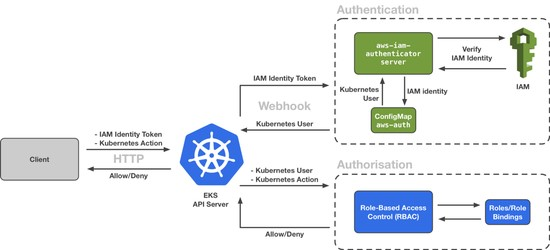

##EKS AUTH

* EKS authentication and authorisation is a combination of AWS Iam Role and policies and Kubernetes RBAC ( Role-based access control ) 
The aws-auth configmap from namespace kube-system maps an iam role with a kube role.

The configmap looks similar to this
```
apiVersion: v1
data:
  mapRoles: |
    - groups:
      - system:bootstrappers
      - system:nodes
      rolearn: arn:aws:iam::111122223333:role/node
      username: system:node:{{EC2PrivateDNSName}}
    - groups:
      - eks-console-dashboard-full-access-group
      rolearn: arn:aws:iam::111122223333:role/my-console-viewer-role
      username: my-console-viewer-role
  mapUsers: |
    - groups:
      - system:masters
      userarn: arn:aws:iam::111122223333:user/admin
      username: admin
    - groups:
      - eks-console-dashboard-restricted-access-group      
      userarn: arn:aws:iam::444455556666:user/my-user
      username: my-user
```

Diagram 



For IAM roles to access the cluster they need at least this permission
```
The iam role must also have this policy attached to it
{
    "Version": "2012-10-17",
    "Statement": [
        {
            "Effect": "Allow",
            "Action": [
                "eks:DescribeCluster",
                "eks:ListClusters"
            ],
            "Resource": "*"
        }
    ]
}
```

* For users: \
To get the kube config and be able to execute kubectl commands directly on the EKS cluster the credentials are needed. \
For this an aws cli call is required. Below is an example for a cluster in eu-west-1 named **eks-test**. \

> **Please make a backup of the old kube config file (typically .kube/config) because the following command might overwrite it. To be sure this will not happen provide a file for argument --kubeconfig.**

```
aws eks --region eu-west-1 update-kubeconfig --name eks-test --alias eks-test
```