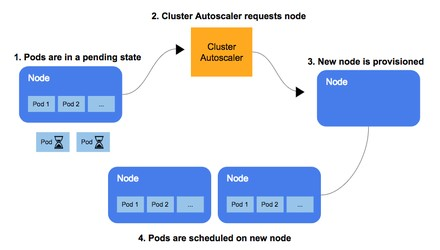

## Node Autoscaling

Autoscaler https://github.com/kubernetes/autoscaler for node (ec2 instance) scaling based on demand. 



Will control ASGs with tag: "key" = "k8s.io/cluster-autoscaler/enabled"
Scale up if pods are in pending. Scale down if resource utilisation is below a certain CPU percentange configured and the pods can be scheduled on other nodes .

* To test the scale out of the EKS worker nodes . \
```kubectl get nodes```

* To increase the number of worker nodes, run the following commands. his command creates a deployment named autoscaler-demo using an NGINX image directly on the Kubernetes cluster, and then launches 50 pods.
```
kubectl create deployment autoscaler-demo --image=nginx
kubectl scale deployment autoscaler-demo --replicas=50
```

* To check the status of your deployment and see the number of pods increasing, run the following command \
```kubectl get deployment autoscaler-demo --watch```

* When the number of available pods equals 50, check the number of worker nodes by running the following command \
```kubectl get nodes```

* Clean up the test deployment \
To scale down the worker nodes by deleting the deployment \
```kubectl delete deployment autoscaler-demo```