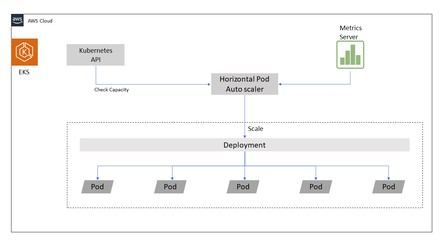

## Pod Autoscaling

We are using the native Horizontal Autoscaling ( https://kubernetes.io/docs/tasks/run-application/horizontal-pod-autoscale-walkthrough/ )to increase the number of replicas based on CPU / Memory. \
It can also support custom metrics. Applications must support this before implementing it. If HPA is enabled, replicas should not be defined in deployment.



* To check for current HPA \
```kubectl get hpa -n default```

* Definition to add a HPA with CPU and Memory scaling. Once the threshold is passed a new replica is launched.
```
apiVersion: autoscaling/v2beta2
kind: HorizontalPodAutoscaler
metadata:
  name: nginx
  namespace: default
spec:
  scaleTargetRef:
    apiVersion: apps/v1
    kind: Deployment
    name: nginx
  minReplicas: 1
  maxReplicas: 10
  metrics:
  - type: Resource
    resource:
      name: cpu
      target:
        type: Utilization
        averageUtilization: 50
  - type: Resource
    resource:
      name: memory
      target:
        type: AverageValue
        averageValue: 100Mi
```

* Use behaviour on scaling pods
https://kubernetes.io/docs/tasks/run-application/horizontal-pod-autoscale/#support-for-configurable-scaling-behavior

* Using custom metrics . This requires prometheus adapter https://github.com/prometheus-community/helm-charts/tree/main/charts/prometheus-adapter \
To get the list of available metrics: kubectl get --raw /apis/custom.metrics.k8s.io/v1beta1 | jq \
Other rules can be added using the helm.

* Scale up the pods in a deployment if there are more than 10 requests per second per pod using Istio metrics .
```
apiVersion: autoscaling/v2beta2
kind: HorizontalPodAutoscaler
metadata:
  name: nginx
  namespace: default
spec:
  scaleTargetRef:
    apiVersion: apps/v1
    kind: Deployment
    name: podinfo
  minReplicas: 1
  maxReplicas: 10
  metrics:
  - type: Pods
    pods:
      metric:
        name: istio_requests
      target:
        type: AverageValue
        averageValue: 10
```